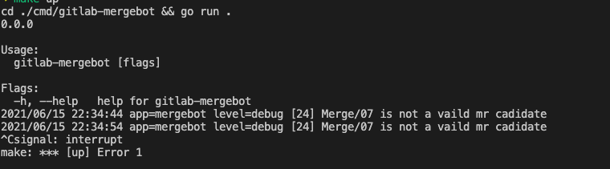
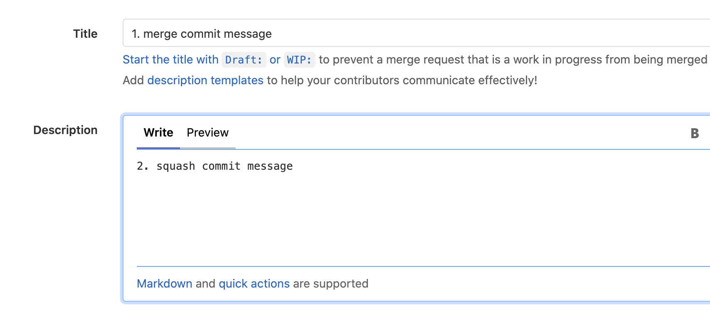
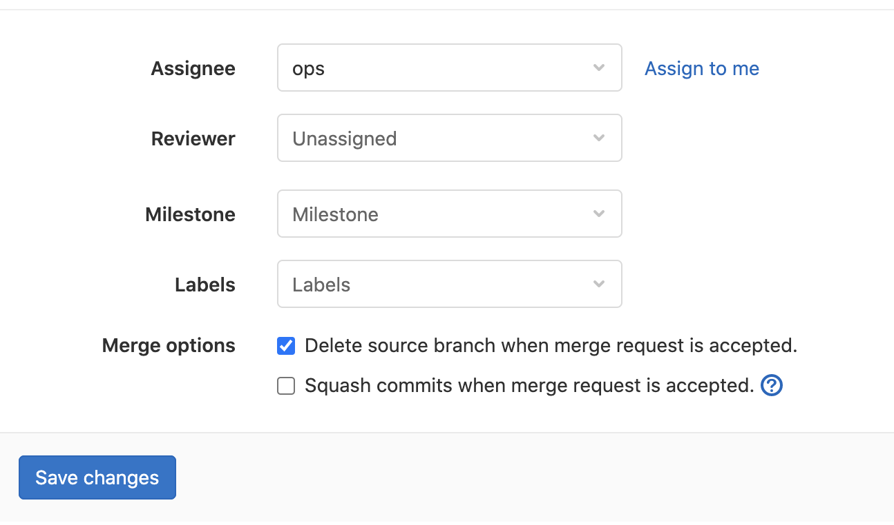

# gitlab-mergebot

gitlab merge request robot 是一个 golang 编写的 gitlab mr 请求处理扩展服务。

由于 `gitlab(free plan)` 的 Merge Request 功能有限， 不能支持多人 Code Reivew。 因此引入第三方机器人进行 MR 合法性仲裁。

**设计思路**

1. 目标的安全: 使用 **目标项目和分支** 中的 `.mergebot.yml` 配置作为机器人判定配置
2. 有意义的文字信息: 使用 **Merge Request** 的 `Title 和 Description` 作为合并后的的 `commit message`。
  + 以约束 Merge Request 的语意完整， 以及维护与 commit 的关联
3. 以人为本: 可以将通过 Code Review 的 Merge Request 转移给其他 Assignee 进行最终合并。

## 使用说明 Usage

### 1. 启动 `mergebot` 服务

1. 在 `gitlab` 上选择任意一个公共账户， 或创建一个新账户。
2. 在**用户配置**中， 创建 `Access Token` ， 权限为 `api`。
3. 启动 `mergebot`

```bash
GITLAB_Endpoint="https://git.example.com"
GITLAB_PrivateToken="Adfasdfadfasdfaksdjf"
./gitlab-mergebot
```



### 2. 源分支管理

#### 2.1 Create Merge Request

**Commit Message** 选择使用 MR 的 `Title` 和 `Description` 是为了约束用户更加重视信息的 **规范性** 及 **完整性**。

**文档即注释**

1. `merge_commit_message` 的内容为 `merge request` 的标题 **Title** 内容。
2. `squash_commit_message` 的内容为 `merge request` 的描述 **Description** 内容。



**Assignee**

2. 将 **Assignee** 选择人为 **mergebot**




### 3. 目标分支管理

#### 3.1 机器人配置 `.mergebot.yml`

1. 将 **mergebot** 加入 **项目** 或 **项目所在的 group**， 权限设置为 `Developer`

2. 在目标分支的 **根目录** 下创建 `.mergebot.yml`， 如下

```yaml
# 最少 code review 人数
minReviewers: 2

# code review 有效名单
reviewers:
  - guanyu 
  - zhangfei
  - zhaoyun

# 合并操作候选人员名单
## 如果存在， mergebot 将在满足合并条件时， 随机选择一位候选人并转让
## 如不存在， mergebot 将直接合并
assignees:
  - zhugeliang

# 是否压缩 commit
squash: true
# 删除源分支
shouldRemoveSourceBranch: true
# 需要 pipeline 成功才能合并。 注意: 无 pipeline 视为不成功
mergeWhenPipelineSucceeds: true
```


#### 3.2 Code Review

1. 任意用户都可以在 MR 下进行评论
2. 但只有在 **目标分支** 中 `.mergebot.yml` 分支中的 CodeReivewer 中的候选人评论内容为 `@gitlab lgtm` 时， 机器人才会进行有效计数。

### 4. Transfer Assignee or Merge

当 `.mergebot.yml` 中的 `assignees` 控制该行为。

1. 当 `assignees` 有效时， `mergebot` 将会随机选择一位候选人， 并设置为 `Assignee` 对象。 并有改用户进行后续合并管理。
2. 当 `assignees` 无效时（无候选人）， `mergebot` 将直接进行 **合并操作**。
